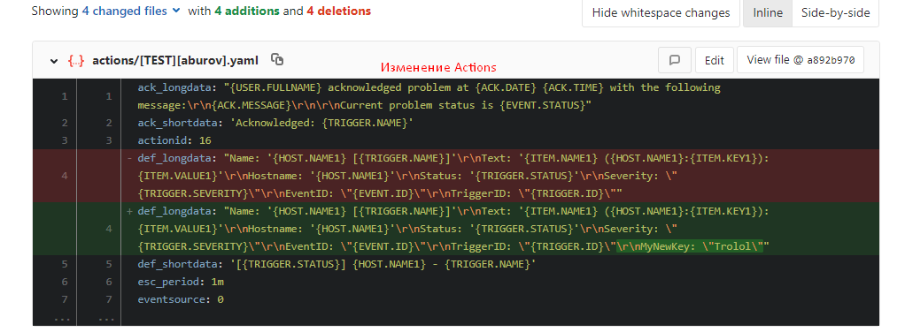
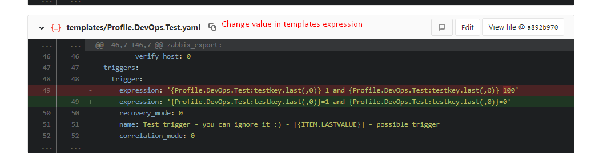
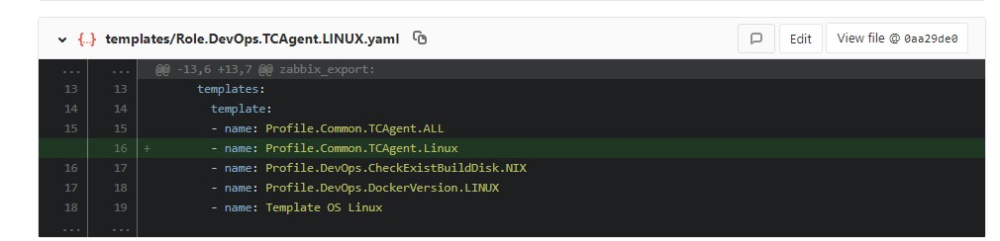
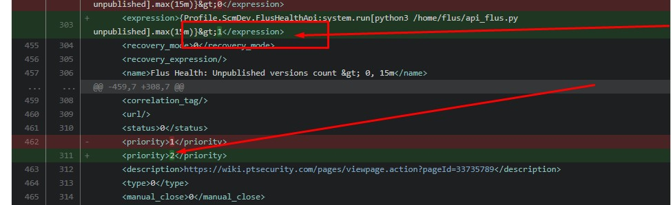

# Zabbix Review and Export
With Zabbix review and export (backup) you can create review mechanism and save zabbix configuration as code (Monitoring as Code)

You can only export (backup) all hosts templates and other object with `zabbix-export.py` script.

- [Requirements](#requirements)
- [Make export and backup](#make-export-and-backup)
- [Make review](#make-review)
  - [Notes](#notes)
- [Supported objects](#supported-objects)
- [Known issues](#known-issues)
- [Screenshots](#screenshots)

# Requirements
- Installed [Python >=3.4](https://www.python.org/downloads/)


If you want use [review (or Monitoring as Code](#make-review):
- [GitLab](https://gitlab.com/) - you own instance with configured [GitLab CI](https://docs.gitlab.com/ee/ci/) or cloud account
- `git`


## Make export and backup
It's simple to start use this script as backup mechanism:
```bash
# git clone THIS_REPO or download and unpack archive

python -mpip install -r requirements.xml

# smoke test :)
python ./zabbix-export.py --help

# backup to current folder, save XML and JSON
python ./zabbix-export.py --zabbix-url https://zabbix.example.com --zabbix-username user --zabbix-password password

# backup zabbix configuration in YAML format
python ./zabbix-export.py --save-yaml --zabbix-url https://zabbix.example.com --zabbix-username user --zabbix-password password

# backup to custom folder in YAML format
python ./zabbix-export.py --save-yaml --directory /home/username/path/to/zabbix-yaml --zabbix-url https://zabbix.example.com --zabbix-username user --zabbix-password password
```

## Make review
You want to make review (Moniroting as Code). Read more on habr.com: [RU](#), [EN translated](#)
1. Fork this repository to you GitLab account or instance (e.g. `groupname/zabbix-review-export`)
2. Create repository where will be saved XML and YAML (e.g. two repositories `groupname/zabbix-xml` and `groupname/zabbix-yaml`. Do first (init) commit (create empty `README.md`).
3. Create two branches in this repos: `master` and `develop`. In repository `groupname/zabbix-xml` set `develop` as a [default branch](https://docs.gitlab.com/ee/user/project/repository/branches/#default-branch).
4. Specify [Project Variables](https://docs.gitlab.com/ee/ci/variables/#variables) for all variables, specified on top of [.gitlab-ci.yml](./.gitlab-ci.yml)
5. Change jobs in `.gitlab-ci.yml` and leave the ones you need job in `.gitlab-ci.yml` and change to you environment (see commented examples block).
6. Try to run manual job `YAML zabbix`
7. Create merge request `develop=>master` in `zabbix-yaml`. For first time you can merge without review, it's too hard :)
8. Configure [Schedule](https://docs.gitlab.com/ee/user/project/pipelines/schedules.html) (eg. every week)
9. Change some host, template or other [supported objects](#supported-objects) in zabbix, run manual job and create merge request again. Enjoy!

### Notes
Use two repositories for XML+JSON (raw-format) and readable YAML format:
- `XML` + `JSON` will be useful if you want restore some object after remove or alarge number of changes.
- `YAML` format is more suitable for people to read and review changes. The script removes all empty values.

Create empty merge request `develop=>master` after merge and receive notifications at changes (schedule or manual jobs run) on your email.

To answer for the question "Who make this changes?" you need use [Zabbix Audit](https://www.zabbix.com/documentation/4.0/manual/web_interface/frontend_sections/reports/audit). It's difficult but possible.

## Supported objects
Use standart [zabbix export functional](https://www.zabbix.com/documentation/4.0/manual/api/reference/configuration/export):
- hosts
- templates
- screen

Representing objects as JSON using the API:
- mediatypes
- actions

## Known issues
- [ZBX-15175](https://support.zabbix.com/browse/ZBX-15175): Zabbix export - host's xml does not contain overrides or diff to templates (e.g. item's storage period, trigger.priority, trigger.status=disables\enabled)
- [ZBXNEXT-4862](https://support.zabbix.com/browse/ZBXNEXT-4862): The implementation of functionality in Zabbix. Zabbix configuration as code - save XML in git repository


## Screenshots
YAML change action:


YAML change trigger expression:


YAML link template


XML change templates (but we recommend use YAML for review and XML only for backup):

